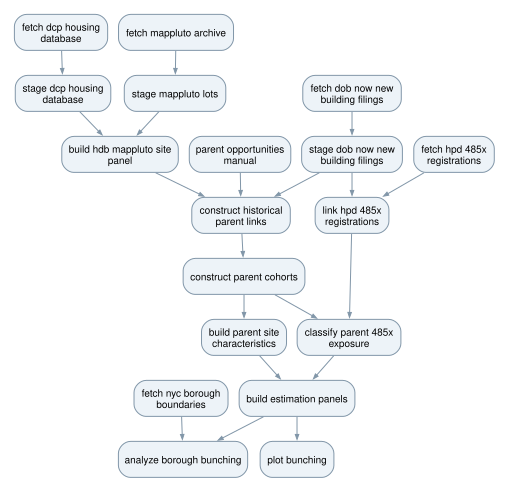

# NYC 99 Units

This project studies bunching below the 100-unit threshold in New York City's
485-x program and whether developers divide larger projects into several
filings. A *constituent* is one building filing; a *parent* is the economic
development opportunity containing one or more constituents. The main pipeline
builds the parent and constituent panels and the descriptive exhibits, and
estimates the joint size-and-organization model described in
`framework_writeup.tex`.

The comparison is 2019–2022 versus January 1, 2025–July 8, 2026.

- **Historical proposals** use the inactive-inclusive **23Q4 Housing Database**,
  keeping each proposal's status. Missing counts are not filled from later releases.
- **Post-policy counts** use **25Q4 Housing Database Class A units**, with DOB
  initial-filing units where HDB is missing. Recorded zeros stay zero.
- **Documentary unit counts** are comparison evidence, never overrides.
- **Parents** join filings through shared lots, lot histories, project
  references, adjacency, and same-owner companion filings within 150 m (or the
  same tax block within 200 m) filed within a year, in both periods.
- **Reviewed links, filing roles and land allocations** are committed decisions
  in `tasks/parent_opportunities_manual`.

## Build

| Command | Builds |
|---|---|
| `make` | Main panels, citywide plots, borough plots and map, task graph |
| `make data` / `plots` / `maps` | A narrower product and its dependencies |
| `make estimate` | Size-and-splitting model estimates (`estimate_notch_model`) |
| `make reweighting` | Reweighted historical benchmark and bootstrap (`audit_scale_shape_splitting`) |
| `make holdout-checks` | Pre-policy placebo and leave-one-year-out checks of that benchmark |
| `make site-boundaries` | Parcel-boundary screen for the weighting sample |
| `make land-sensitivity` | Whether land-measurement choices move the reweighted comparison |
| `make parent-links` | Evidence casebook for reviewed parent links |
| `make companion-rules` | Alternative same-owner linking rules, their hand review, and a stricter-rule check |
| `make framework-writeup`, `make logbook` | The documents, after the inputs they read |

The root Makefile orders the tasks; each task's Makefile decides what is stale.
Task-local `make` in a `code/` folder uses the inputs already prepared, so run
Make from the root after upstream changes. Sources are fetched only when
missing and verified against each fetch task's `checksums.sha256`, so ordinary
builds never download or re-query anything. The supported runtime is recorded
in `tasks/setup_environment`; shared Make and saving conventions are in
`tasks/shared/code/README.md`.

`data_raw/` (not in Git) holds the dated captures that cannot be downloaded
again: DOB NOW and HPD extracts, the DOF tax-map snapshot, current MapPLUTO and
Housing Database files and metadata, borough boundaries, Attorney General
searches, and the review documents in `data_raw/parent_review_documents/`.
Keep it with any replication package. Archived MapPLUTO releases and the 23Q4
Housing Database download from their official URLs if missing.

## Main tasks

| Work | Tasks |
|---|---|
| Acquire HDB, DOB, HPD, MapPLUTO, Attorney General, borough and DOF sources | `fetch_*` |
| Load and normalize records and parcel releases | `stage_*` |
| Attach parcel histories and build parents | `build_hdb_mappluto_site_panel`, `construct_historical_parent_links`, `construct_parent_cohorts` |
| Committed decisions; HPD links; exposure | `parent_opportunities_manual`, `link_hpd_485x_registrations`, `classify_parent_485x_exposure` |
| Parent characteristics and final panels | `build_parent_site_characteristics`, `build_estimation_panels` |
| Exhibits | `plot_bunching`, `analyze_borough_bunching` |
| Size-and-splitting model | `estimate_notch_model` |

Outputs: `tasks/build_estimation_panels/output/parent_opportunity_panel.parquet`
and `constituent_filing_panel.parquet`; citywide plots in
`tasks/plot_bunching/output/pdf/main_project_plots.pdf`; borough plots and the
exact-99 map in `tasks/analyze_borough_bunching/output/borough_bunching.pdf`;
model estimates in `tasks/estimate_notch_model/output/estimates.csv`.

## Audits and research record

`tasks/audits/README.md` lists the audits. No main task depends on one.
Research decisions, findings and open questions are recorded in `logbook/`.
Tag `pre-cleanup-2026-09-22` preserves the repository before the September 2026
cleanup, including the removed audits and per-parent review memos.
